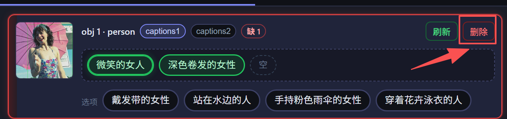
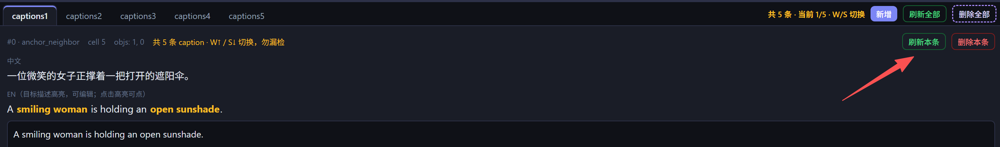
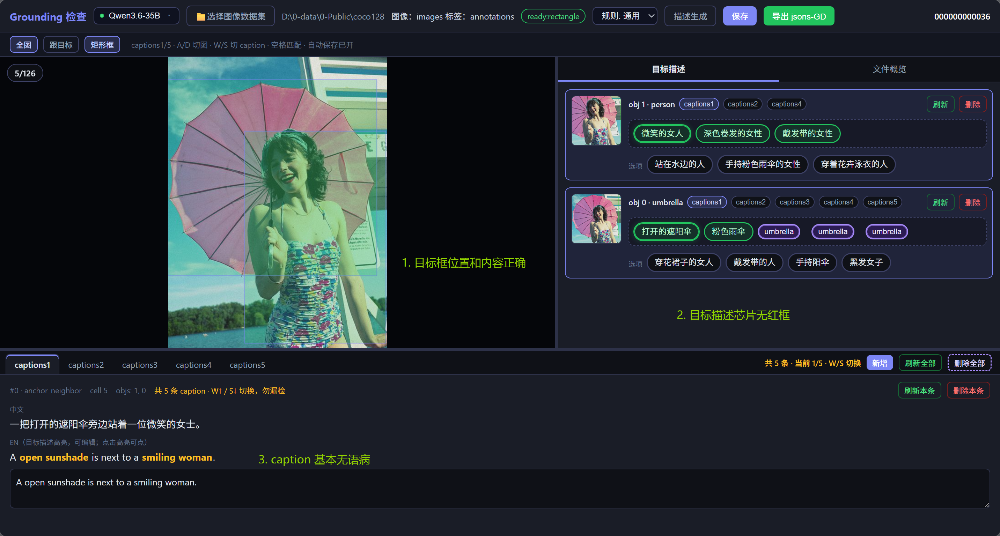
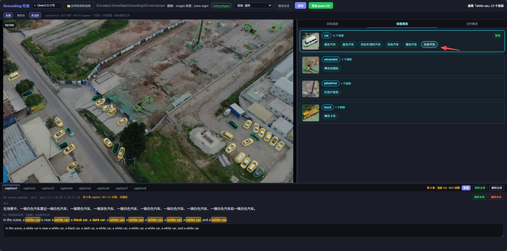
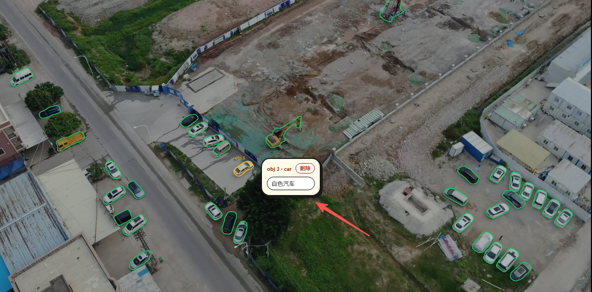

# Grounding 标注规则 [v0.6.9]

# 1 标注背景

- 视觉定位（grounding）：每张图多个目标框，每个目标若干英文描述短语；再组成多条 caption，并记下短语在句中的位置。

  
- 模型预生成描述与 caption；标注员校对、改选、删补，保证图文一致后再导出 `jsons-GD`。
- 中间结果在数据集 `draft/`。

# 2 标注场景

- **通用**（默认）：道路 / 街景 / 航拍等，描述可含子类、动作、方位。
- **appearance**：只写外观（如 `white car`），禁止源标签和 sedan 等子类。
- 类别以原标注为准，看不见的细节不要编。

# 3 标注规则

### 3.1 打开工具与选择数据集

1. 启动：Windows 双击 `1-start_review.bat`；Linux `bash z-others/1-start_review.sh`。
2. 顶栏选多模态服务（绿点可用）。

   
3. 「选择图像数据集」：先图像目录，再标签目录。

   
4. 需要时「描述生成」→ 优先「续跑补齐」。一般已有生产数据，不必重新生成。

   
5. 规则场景按项目选（通用 / appearance 等）。换下拉不会自动重跑。

   

### 3.2 校验流程（目标描述）

右侧默认页签是 **目标描述**。用 `W` / `S` 把该图全部 caption 过一遍（默认 5 条，到头不循环）。

1. 核对框位置；点词条或框可互相同步高亮。框错才删目标。

   
2. 按目标填空：caption 里出现几次，就**至少**几个不同特征。不够则卡片发红；**未填满不能切下一张图**。

   
3. 点填空里的**空**，该格改用源标签（如 `umbrella`）；再点取消。

   
4. 选中芯片后，标题旁会标该目标出现在哪些 caption，可点切换。

   
5. 从选项点特征填入；不合适可刷新换一批。

   
6. 底部英文 caption：已选短语须**原样出现**；不通顺用「刷新」或手改，**不要改短语原文**。

   
7. 切图 / 切 caption **自动保存**。一批完成后导出 `jsons-GD`。
8. 相邻图几乎相同：`T` 叠上一张配对拷描述（见 Tips）。
9. 合格后再切下一张：框对、填空齐、caption 通顺、本图全部 caption 已核。

   

### 3.3 校验流程（标签概览）

右侧切到 **标签概览**：按类别成卡（大类芯片 + 青色描述椭圆）。

- **全部描述**：点描述词会在图中高亮所有带该描述的目标。

  
- **点图中目标**：目标旁弹出对话框，列出该目标全部描述。点空处收起。`R` 隐藏框后不可点选。

  
- **相关操作**
  - **Delete**：未点对话框描述 → 删整个目标（有确认）；已点某条 → 只删该条。对话框标题「删除」等同删目标。
  - **G 改描述**：全图目标可选。点对话框中的描述后 `Delete` 删该条；点右侧描述后 `B` 替换、`F` 新增。其它类及该目标已有描述会变灰。再按 `G` 退出。
  - **V 点亮/点灭**：先点右侧一条描述，再 `V`。点目标加上或去掉该描述（已有为实线青框，未有为虚线灰框）。`F` 确认写入并退出；`V` / `Esc` 退出不写入。
  - 类别卡上的 **整理**：只排该类芯片顺序（上衣/帽子/裤子等挨在一起），不改文案。

### 3.4 Tips

- **绿芯片** = 已选用；带光晕 = 当前这条 caption 领到的。点掉只退回点中的那条。
- **空** = 未填。点一下改用源标签，再点取消。
- **选项** = 未填入的候选。刷新时已锁维度不再换皮（已选红色轿车则不再出红色汽车）。
- 卡片发红只拦**切图**，不拦切 caption。
- 相邻图几乎相同：`T` 叠上一张（紫框=上一张，绿框=当前）→ 点紫再点绿 → `F` 拷描述。按当前张槽位数填满即可。再按 `T` 退出。

### 3.5 快捷键

| 按键 | 作用 |
| --- | --- |
| `A` / `D` | 上一张 / 下一张图 |
| `W` / `S` | 上一条 / 下一条 caption（到边界停止） |
| `Q` / `E` | 全图适配 / 跟目标 |
| `R` | 显示 / 隐藏标注框 |
| `T` | 进入 / 退出「匹配上一张」 |
| `F` | 确认（匹配拷描述 / 改描述新增 / 点亮写入） |
| `G` | 标签概览：进入 / 退出改描述 |
| `V` | 标签概览：点亮 / 点灭当前描述 |
| `B` | 改描述态：用右侧描述替换对话框选中条 |
| `Delete` | 标签概览：删目标；改描述且已点对话框描述时只删该条 |
| `Esc` | 取消当前选中 / 退出点亮（不写入） |
| `Ctrl` + 滚轮 | 缩放 |
| 拖拽主图 | 平移 |
| 右键（已选中目标卡） | 刷新该目标描述 |

# 4 常见错误与模糊情况

暂无
