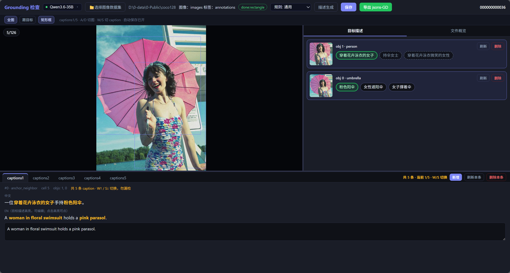

# 🏷️ YOLOE Grounding 检验工具

面向检测/分割标注的 Grounding 描述生成与人工检验：裁目标 → vLLM 描述 → 组合 caption → Web 审阅 → 导出 `jsons-GD`。



---

## 1 项目结构

```
yoloe/
├── 1-start_review.bat      # Windows 启动审阅界面（默认端口 8090）
├── model/
│   └── server.json         # 多模态服务列表（可切换、健康探测）
├── rules/                  # describe / caption 规则文档
├── util/
│   ├── app.py              # Flask 审阅后端 + Web UI
│   ├── generate.py         # 批量生成入口（crop→describe→caption）
│   ├── crop_objects.py     # 目标裁剪
│   ├── describe.py         # 单目标描述
│   ├── caption.py          # caption 组合 / 刷新
│   ├── export_gd.py        # 导出 jsons-GD
│   ├── validate_dataset.py # 数据集结构校验（结果可缓存）
│   └── templates/          # 前端页面
├── build/
│   ├── 一键打包.bat         # 维护者打绿色便携包
│   └── 使用说明.txt         # 便携包用户说明
└── z-others/
    ├── 0-generate.sh       # Linux 批量生成脚本
    ├── 1-start_review.sh   # Linux 启动审阅界面（默认端口 8082）
    ├── 标注规则.md          # 标注员操作规范（含配图）
    ├── 开发日志.md          # 迭代记录
    ├── 初始需求.md          # 原始需求备忘
    └── pic/                # README / 标注规则配图
```

---

## 2 环境搭建

### 2.1 依赖

- **Python 3** + `flask` / `pillow` / `tqdm` / `requests`（启动脚本缺依赖时会尝试自动安装）
- **远程或本地 vLLM** 多模态服务（OpenAI 兼容 `/v1`，用于 describe / caption / 中英翻译）
- Windows 原生选文件夹依赖运行时自带的 **tkinter**（便携包已含）

### 2.2 配置模型服务

编辑 `model/server.json`：

```json
{
  "services": [
    {
      "id": "0",
      "name": "Qwen3.6-35B",
      "base_url": "http://HOST:8081/v1",
      "port": 8081,
      "model": "qwen3.6-35b-a3b",
      "default": true
    }
  ]
}
```

- 界面顶栏可切换服务，并显示连通状态（绿/红点）
- 也可用环境变量兜底：`VLLM_BASE_URL`、`VLLM_MODEL`

### 2.3 Windows 便携包（无本机 Python）

1. 维护者双击 `build/一键打包.bat`，产物在 `build/0-dist/GroundingReview-portable-*.zip`（当前示例：`v0.3.24`）
2. 同事解压后双击 `start.bat` → 浏览器打开 `http://localhost:8090`（端口占用时自动 +1）
3. 详细说明见 `build/使用说明.txt`

---

## 3 数据集约定

选择向导分两步：**图像目录** → **标签目录**。默认兼容 `images/` + `jsons/`，也支持更灵活的相对名或绝对路径。

```
YOUR_DATA_DIR/
├── images/          # 或 JPEGImages / 其它含图目录 / 根目录直接放图
├── jsons/           # LabelMe .json（rectangle / polygon / mixed）
├── jsons-det/       # 可选：检测框专用
├── jsons-segm/      # 可选：多边形专用（jsons-sem 为别名）
├── annotations/     # 可选：VOC .xml（bbox → 矩形）
├── draft/           # 运行时生成（objects / descriptions / captions / validate_log）
└── jsons-GD/        # 导出产物（Flickr 风格 grounding）
```

- 标签与图像按 **同名 stem** 配对
- 几何类型：`rectangle` / `polygon` / `mixed` 均可；主窗口按类型可视化
- 中间结果写在 `draft/`，人工修改会落盘；续跑生成默认「缺啥补啥」，不覆盖已有非占位结果
- 全量格式校验结果缓存在 `draft/validate_log.json`；标签签名未变则跳过重扫（「重新生成」会强制重扫）

---

## 4 使用方式

### 4.1 启动审阅界面

**Windows：**

```bat
1-start_review.bat
1-start_review.bat --port 8090
1-start_review.bat --dataset D:\data\your_dataset
```

**Linux：**

```bash
bash z-others/1-start_review.sh
bash z-others/1-start_review.sh --port 8082
bash z-others/1-start_review.sh --dataset /path/to/dataset
```

或直接：

```bash
python util/app.py --port 8082
```

- 关闭控制台 / `Ctrl+C`：释放**本实例**端口（刷新或关网页标签不会退出）
- **可多开**：首选端口被占用时自动改用 `PORT+1`…，不会杀掉其它已开窗口

### 4.2 界面流程

1. 顶栏选择多模态服务（可选）
2. 点击「📁选择图像数据集」：先选图像目录，再选标签目录
3. 校验通过后，按需「描述生成」：
   - **续跑补齐**：只补缺失的 crop / describe / caption
   - **重新生成**：强制重跑 describe + caption（并强制重做格式校验）
4. 审阅目标描述与 captions（界面显示中文，落盘英文）
5. 导出 `jsons-GD`：当前文件或整个文件夹

标注操作细则与配图见 `z-others/标注规则.md`。审阅时请留意：

- 每个目标右侧一般展示 **最多 6 条**候选描述 + 末尾「保留源标签」；**亮绿**为当前 caption 已选；选源标签则只用标签组 caption、不可再选描述词；有已选再点刷新时，会保留已选并生成 2 条贴近变体 + 其余多样化
- **虚线**短语表示已被其它 caption 占用，尽量换一条，避免重复
- caption **不可为空**：未选目标描述时切换 W/S 或点 tab 会提示补选
- 不同目标禁止写成「A is also B」这类合并歧义句；同目标才可用同位语
- 刷新描述会尽量保留当前 caption 已选短语，只重刷其余空位

### 4.3 快捷键

| 按键 | 作用 |
|------|------|
| `A` / `D` | 上一张 / 下一张图 |
| `W` / `S` | 上一条 / 下一条 caption（到边界停止，不循环） |
| `Ctrl` + 滚轮 | 以光标为中心缩放 |
| 拖拽主图 | 平移 |

焦点在输入框内时快捷键不触发。

### 4.4 命令行批量生成

```bash
# 修改 z-others/0-generate.sh 内 DATASET / BASE_URL / MODEL 后：
bash z-others/0-generate.sh
bash z-others/0-generate.sh --limit 2
bash z-others/0-generate.sh --stages describe,caption --workers 8
bash z-others/0-generate.sh --export
```

等价 Python：

```bash
python util/generate.py \
  --dataset /path/to/dataset \
  --base_url http://127.0.0.1:8081/v1 \
  --model qwen3.6-35b-a3b \
  --n_captions 5 \
  --workers 8
```

常用参数：

- `--stages`：`all` / `crop` / `describe` / `caption` / `export`（逗号分隔）
- `--images` / `--jsons`：图像与标签目录名（默认 `images` / `jsons`）
- `--force`：强制重写已有结果
- `--no_llm`：仅调试占位（**正式数据不要用**）

---

## 5 规则与导出

### 5.1 规则文件

| 文件 | 用途 |
|------|------|
| `rules/describe_rules.md` | 单目标描述规则 |
| `rules/caption_rules.md` | caption 句式组合（短语锁定、同 obj 不拆人、异 obj 禁止 is also 合并） |
| `rules/*_vesthalmet.md` | 场景规则示例（`--rules-scene vesthalmet`） |
| `z-others/标注规则.md` | 标注员流程与合格标准 |

修改规则后，界面内「刷新」会按新规则重组；短语本身仍以当前选中为准。

### 5.2 导出

- UI：导出弹窗选「仅当前文件」或「整个文件夹」→ 写入数据集下 `jsons-GD/`
- CLI：`python util/export_gd.py --dataset /path/to/dataset`，或 `generate.py --export`

---

## 6 常见问题

- **离线 / vLLM 不可用**：若 `draft/` 已完整，可直接打开审阅；仅在缺 describe/caption 时才探测服务
- **曾用 `--no_llm` 写出占位描述**：正式重跑时不要加 `--no_llm`；需覆盖时加 `--force`，或界面「重新生成」
- **大数据集启动卡在校验**：签名未变会复用 `draft/validate_log.json`；标签有增删改或点「重新生成」才会全量重扫
- **想同时开多个审阅窗口**：直接再双击 bat；端口占用自动递增，不会关掉旧实例
- **切图/切 caption 变慢**：打开图为纯读盘；中文翻译后台异步补齐
- **caption 为空被拦住**：须先在右侧点选目标描述，再切换到其它 caption
- **Windows 改远程地址**：编辑 `1-start_review.bat` 顶部的 `VLLM_BASE_URL` / `VLLM_MODEL`，或改 `model/server.json`
- **迭代细节**：见 `z-others/开发日志.md`
