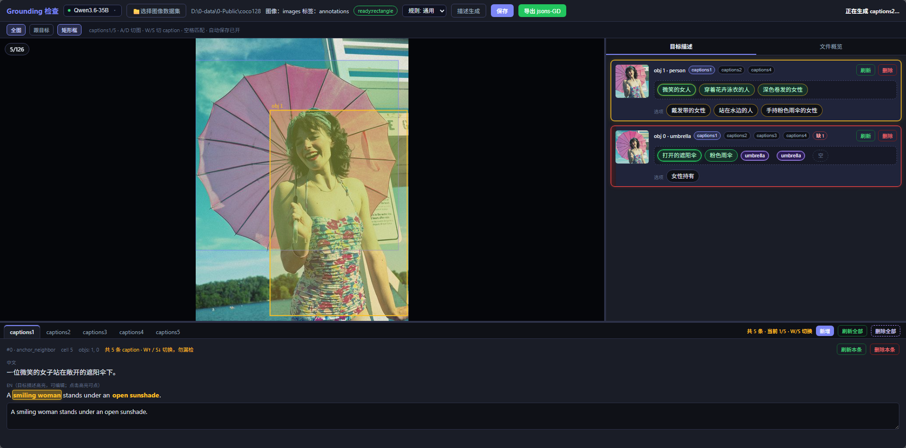

# 🏷️ YOLOE Grounding 检验工具

裁目标 → vLLM 描述 → 组合 caption → Web 审阅 → 导出 `jsons-GD`。



标注员操作（流程 / Tips / 快捷键）见 [`z-others/标注规则.md`](./z-others/标注规则.md)。

---

## 1 项目结构

```
yoloe/
├── 1-start_review.bat      # Windows 启动审阅（默认 8090）
├── model/server.json       # 多模态服务列表
├── rules/                  # describe / caption 规则
├── util/
│   ├── app.py              # Flask 审阅后端 + Web UI
│   ├── generate.py         # 批量生成（crop→describe→caption）
│   ├── crop_objects.py     # 目标裁剪
│   ├── describe.py         # 单目标描述
│   ├── caption.py          # caption 组合 / 刷新
│   ├── export_gd.py        # 导出 jsons-GD
│   └── validate_dataset.py # 数据集校验
├── build/                  # 一键打包 / 便携包说明
└── z-others/
    ├── 0-generate.sh       # Linux 批量生成
    ├── 1-start_review.sh   # Linux 启动审阅（默认 8082）
    ├── 标注规则.md          # 标注员规范（含配图）
    └── 开发日志.md          # 迭代记录
```

---

## 2 环境搭建

- **Python 3** + `flask` / `pillow` / `tqdm` / `requests`（启动脚本缺依赖时会尝试自动安装）
- **vLLM** 多模态服务（OpenAI 兼容 `/v1`）
- Windows 选文件夹需要 **tkinter**（便携包已含）

编辑 `model/server.json`：

```json
{
  "services": [
    {
      "id": "0",
      "name": "Qwen3.6-35B",
      "base_url": "http://HOST:8081/v1",
      "port": 8081,
      "model": "qwen3.6-35b-a3b",
      "default": true
    }
  ]
}
```

界面顶栏可切换服务（绿/红点）。也可用 `VLLM_BASE_URL` / `VLLM_MODEL`。

**便携包：** 维护者双击 `build/一键打包.bat` → `build/0-dist/GroundingReview-portable-v0.5.4.zip`。同事解压后双击 `start.bat`（`http://localhost:8090`，端口占用自动 +1）。说明见 `build/使用说明.txt`。

---

## 3 数据集约定

选择向导：**图像目录** → **标签目录**。按 **同名 stem** 配对。

```
YOUR_DATA_DIR/
├── images/          # 或 JPEGImages / 根目录直接放图
├── jsons/           # LabelMe .json（rectangle / polygon / mixed）
├── jsons-det/       # 可选：检测框
├── jsons-segm/      # 可选：多边形（jsons-sem 为别名）
├── annotations/     # 可选：VOC .xml
├── draft/           # 运行时：objects / descriptions / captions
└── jsons-GD/        # 导出产物
```

续跑默认「缺啥补啥」，不覆盖已有非占位结果。格式校验缓存在 `draft/validate_log.json`。

---

## 4 使用方式

### 4.1 启动审阅

```bat
1-start_review.bat
1-start_review.bat --port 8090
1-start_review.bat --dataset D:\data\your_dataset
```

```bash
bash z-others/1-start_review.sh --port 8082 --dataset /path/to/dataset
python util/app.py --port 8082
```

关控制台 / `Ctrl+C` 释放本实例端口（关网页不退出）。可多开：端口占用自动 +1。

### 4.2 审阅

1. 顶栏选服务 →「选择图像数据集」（先图像、再标签）
2. 需要时「描述生成」：**续跑补齐**只补缺失；**重新生成**强制重跑 describe + caption
3. 审阅后导出 `jsons-GD`（当前文件或整个文件夹）

填空、匹配上一张、快捷键等见 [`z-others/标注规则.md`](./z-others/标注规则.md)。

### 4.3 命令行批量生成

```bash
# 改 z-others/0-generate.sh 内 DATASET / BASE_URL / MODEL 后：
bash z-others/0-generate.sh
bash z-others/0-generate.sh --stages describe,caption --workers 8
bash z-others/0-generate.sh --export
```

```bash
python util/generate.py --dataset /path/to/dataset \
  --base_url http://127.0.0.1:8081/v1 --model qwen3.6-35b-a3b \
  --n_captions 5 --workers 8
```

- `--stages`：`all` / `crop` / `describe` / `caption` / `export`
- `--images` / `--jsons`：默认 `images` / `jsons`
- `--force`：覆盖已有结果；`--no_llm` 仅调试（正式数据不要用）

---

## 5 规则与导出

| 文件 | 用途 |
|------|------|
| `rules/describe_rules.md` | 单目标描述 |
| `rules/caption_rules.md` | caption 句式（短语锁定） |
| `rules/*_vesthalmet.md` | 场景规则示例 |
| `z-others/标注规则.md` | 标注员流程 |

界面「刷新」按规则重组句式，**不改**已选短语。导出：UI 弹窗，或 `python util/export_gd.py --dataset /path/to/dataset`。

---

## 6 常见问题

- **离线 / vLLM 不可用**：`draft/` 已完整可直接审阅；仅缺 describe/caption 时才探测服务
- **`--no_llm` 占位**：正式重跑不要加该参数；覆盖用 `--force` 或界面「重新生成」
- **大数据集启动慢**：签名未变会复用 `draft/validate_log.json`
- **多开窗口**：再双击 bat，端口自动递增
- **改远程地址**：`1-start_review.bat` 顶部或 `model/server.json`
- **迭代细节**：`z-others/开发日志.md`
