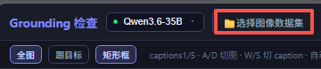
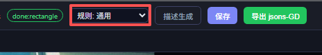
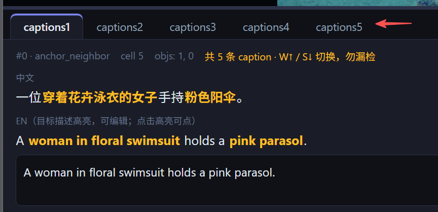
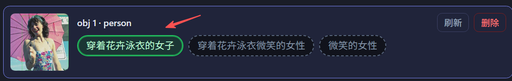
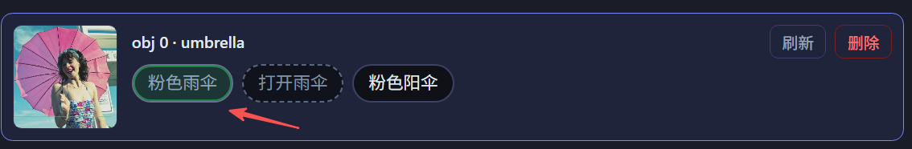
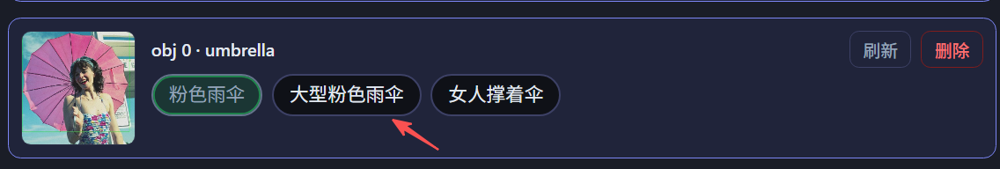
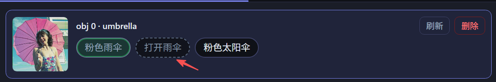
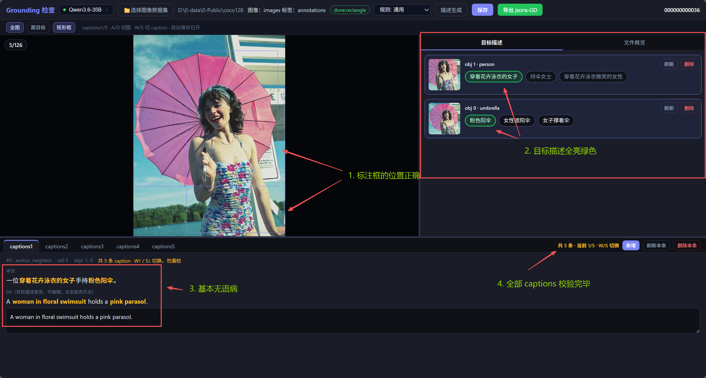
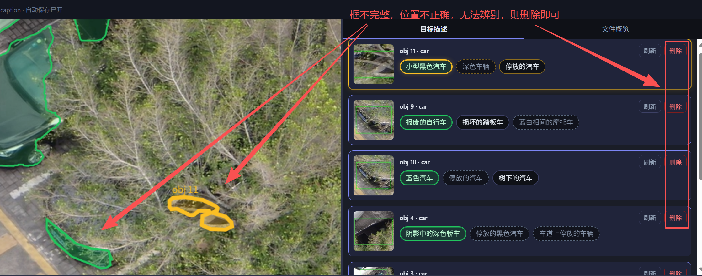
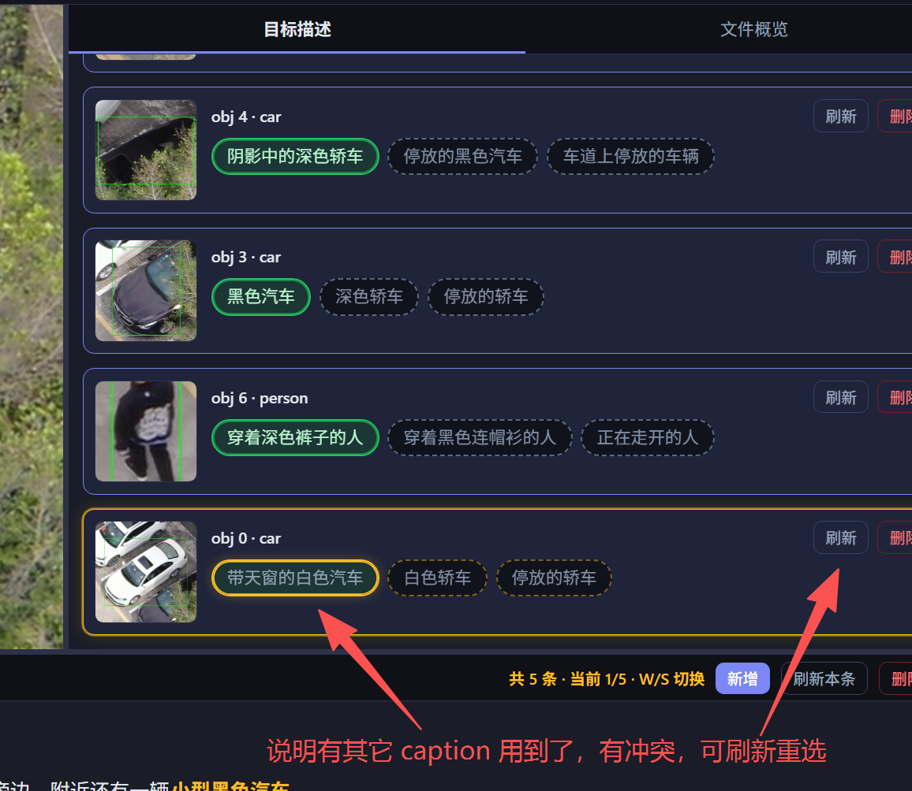

# GroundingView

# 1 标注背景

- 本任务为视觉定位（grounding）数据：每张图有多个目标框，每个目标有若干英文描述短语；再组合成多条 caption，并记录短语在句中的位置。

  
- 模型会预生成描述与 caption；标注员负责校对、改选、改写、删补，保证图文一致、无歧义、可导出。
- 中间结果在数据集 `draft/`；确认无误后再导出 `jsons-GD`。

# 2 标注场景说明

- 通用场景（默认）：道路 / 街景 / 航拍 / 日常物体等，无额外 PPE 等专用约束。
- 类别标签以原标注（LabelMe / VOC 等）为准，描述须与类别一致，不可编造看不见的细节。

# 3 标注规则

### 3.1 打开工具与选择数据集

1. 打开 Grounding 检验工具（便携包双击 `start.bat`）。
2. 顶栏选择可用的多模态服务（绿点可用）。

   
3. 点击「选择图像数据集」：先选图像目录，再选标签目录（如 `images` + `jsons`）。

   
4. 若尚未生成描述：用「描述生成」→ 优先「续跑补齐」；仅在明确要求时用「重新生成」。这个一般已经有生产的数据了，不需要重新生成

   
5. 规则场景按项目要求选择（通用 / 指定场景）。

   

### 3.2 校验流程

1. **用 ****`A`**** / ****`D`**** 切图；用 ****`W`**** / ****`S`**** 切 caption，默认为5条**（到头/尾不再循环，勿漏检）。**`Q`** 全图 / **`E`** 跟目标 / **`F`** 显隐标注框。

   
2. **右侧窗口**只看当前 caption 关联的目标；每个目标一般展示 3 条候选描述（中文显示，英文落盘）。
3. **右侧窗口**点选合适的目标描述，若当前描述不合适，可刷新
   1. **亮绿色** = 当前 caption 已选用且无冲突；

      
   2. **暗绿色** = 当前 caption 已选用但与其他 caption 的描述冲突；

      
   3. **实线未选** = 其它 caption 未用过，可选。

      
   4. **虚线未选** = 其它 caption 用过，尽量换一条

      
4. **每个 caption 都应该有描述目标，不应为空**；切换 caption 若为空会提示「请选择目标描述」——须补选后再离开。
5. 检查底部英文 caption：须包含所有已选短语原文；**不通顺可点「刷新本条」或手改**，但不要改掉短语原文。
6. 框显示/隐藏用左上角「矩形框 / 多边形」开关；**点击词条或框可互相同步高亮**。
7. 删除项
   1. **目标描述删除**：若标注框有误，则删除（此举会直接删掉目标框，不确定的请询问负责人）
   2. **caption 删除**：caption 个数默认为5，若图中内容较简单，则可酌情删除几条 caption
8. 切图 / 切 caption 会**自动保存；改完一批后导出** `jsons-GD`（当前图或整夹按项目要求）。
9. 合格状态：目标描述为全亮，

   
   1. 矩形框/多边形框的位置正确
   2. 目标描述为全亮状态
   3. caption 基本无语病
   4. 当前图像的全部 captions 都核验完毕

# 4 常见错误与模糊情况处理

- **框的位置不正确**

  
- **目标描述非全亮绿色**

  
