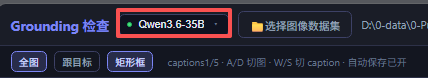
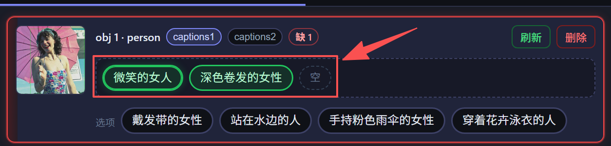
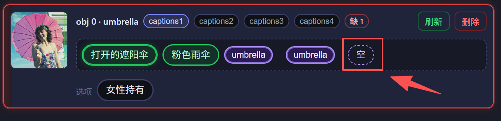
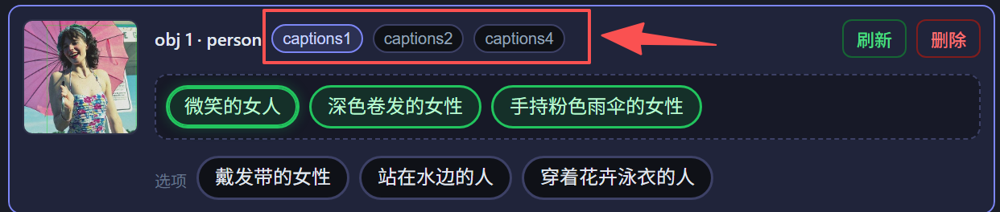
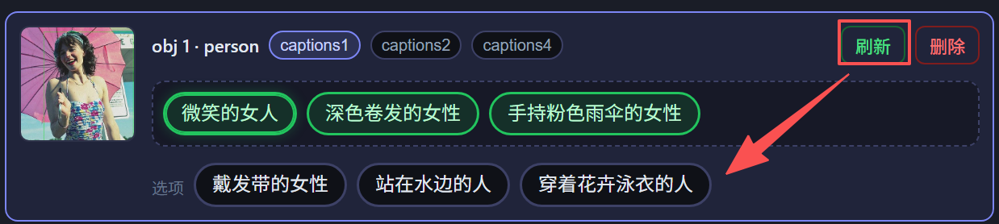

# GroundingView-v2

# 1 标注背景

- 本任务为视觉定位（grounding）数据：每张图有多个目标框，每个目标有若干英文描述短语；再组合成多条 caption，并记录短语在句中的位置。

  
- 模型会预生成描述与 caption；标注员负责校对、改选、改写、删补，保证图文一致、无歧义、可导出。
- 中间结果在数据集 `draft/`；确认无误后再导出 `jsons-GD`。

# 2 标注场景说明

- 通用场景（默认）：道路 / 街景 / 航拍 / 日常物体等，无额外 PPE 等专用约束。
- 类别标签以原标注（LabelMe / VOC 等）为准，描述须与类别一致，不可编造看不见的细节。

# 3 标注规则

### 3.1 打开工具与选择数据集

1. 打开 Grounding 检验工具（便携包双击 `start.bat`）。
2. 顶栏选择可用的多模态服务（绿点可用）。

   
3. 点击「选择图像数据集」：先选图像目录，再选标签目录（如 `images` + `jsons`）。

   
4. 若尚未生成描述：用「描述生成」→ 优先「续跑补齐」；仅在明确要求时用「重新生成」。这个一般已经有生产的数据了，不需要重新生成

   
5. 规则场景按项目要求选择（通用 / 指定场景）。

   

### 3.2 校验流程

1. 切到一张图，用 `W` / `S` 把该图**全部 caption**过一遍（默认 5 条；到头/尾不循环，勿漏检）。
2. 核对框位置；点击词条或框可互相同步高亮。框错才删目标（会删框，不确定问负责人）。

   
3. 右侧按目标填空：caption中出现几次，就**至少**几个不同特征。不够则卡片发红；可先切 caption 稍后再补，**未填满不能切下一张图**。

   
4. 点填空里的**空**，该格改用源标签（如`umbrella`）；再点可取消。

   
5. 选中芯片后，标题`obj N · 类别`旁会标出该目标出现在哪些 caption（如`captions3``captions4`），可点切换。

   
6. **右侧窗口**从选项点特征填入空位；不合适可刷新换一批候选

   
7. 核对底部英文 caption：已选短语须**原样出现**；不通顺则「刷新本条 / 刷新全部」或手改，**不要改短语原文**。

   
8. 切图 / 切 caption**自动保存**。一批完成后导出`jsons-GD`（当前图或整夹按项目要求）。
9. 相邻图目标几乎相同时：可按空格叠上一张，配对拷描述后再退出（见下方的 Tips）。
10. 合格后再切下一张：

    
    1. 矩形框 / 多边形位置正确
    2. 目标填空已齐（特征或源标签）
    3. caption 基本无语病
    4. 本图全部 caption 已核验

### 3.3 Tips

- **填空绿芯片** = 已选用特征；带光晕 = 当前这条 caption 领到的。点掉只退回点中的那条，空位不跟着跳。
- **空**= 还没填。点一下该格改用源标签（如`car`），再点可取消。
- **选项** = 未填入的候选。点一下进入填空；不合适可刷新换一批（已填保留；已锁维度不再换皮，例如已选红色轿车则不再出红色汽车）。
- 可以多选；额外描述写入**当前这条** caption。改填空后相关 caption 会自动刷新。
- 选中芯片后，标题`obj N · 类别`旁会标`captions3``captions4` 等，可点切换。
- 卡片发红只拦**切图**，不拦切 caption。
- 相邻图几乎相同时：空格叠上一张（紫框=上一张，绿框=当前）→ 点紫再点绿 →`R`拷描述填空。按**当前张槽位数**顺序填满即可（上一张更多时只取前面的；更少则填完留空给人工补）。上一张点过「空」的格也按出现顺序拷过来（用**当前框**的类别名）；未配对的目标不动。再按空格退出，相关 caption 会自动刷新。

### 3.3 快捷键

| 按键            | 作用                           |
| ------------- | ---------------------------- |
| \`A\`/\`D\`   | 上一张 / 下一张图                   |
| \`W\`/\`S\`   | 上一条 / 下一条 caption（到边界停止，不循环） |
| \`Q\`         | 全图适配                         |
| \`E\`         | 跟目标适配                        |
| \`F\`         | 显示 / 隐藏标注框                   |
| 空格            | 进入 / 退出「匹配上一张」               |
| \`R\`         | 匹配态：确认 紫框 → 绿框               |
| \`Esc\`       | 匹配态：取消当前选中                   |
| 右键（已选中目标卡）    | 刷新该目标描述                      |
| \`Ctrl\` + 滚轮 | 缩放                           |
| 拖拽主图          | 平移                           |

## **4 常见错误与模糊情况处理**

暂无
